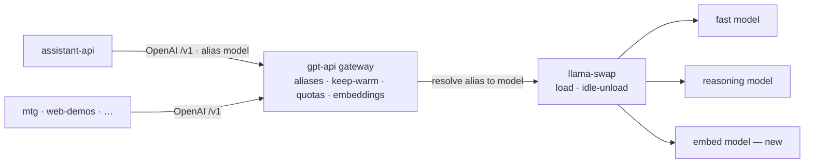

# LLM gateway backbone

**Decision (locked):** gpt-api is the platform's single LLM entry, exposed as an **OpenAI-compatible *gateway*** — the universal contract at the edge, the infra cross-cutting concerns owned inside. Consumers (assistant-api and others) stay plain OpenAI clients that pick a **named tier alias**; the gateway hides the CPU/one-model-at-a-time/swap reality.

**Status:** green-field on role (the contract is set; the gateway smarts below are mostly to-build).

## Purpose
One place every service reaches the LLM. Keeping the OpenAI `/v1` contract means the backend (llama.cpp/llama-swap today, vLLM or a cloud fallback later) is swappable without touching callers, and tool-calling / structured-output / streaming are standardised. Making it a *gateway* (not just a proxy) means the things a shared, CPU-bound, single-model-at-a-time host **must** manage live in one place instead of being re-implemented by every caller.

## What exists today (grounded)
A thin OpenAI proxy in front of llama-swap:
- `POST /v1/chat/completions` (+ SSE `stream`), `POST /v1/completions` (legacy), `GET /v1/models` (proxied from llama-swap, 60 s cache) — `Endpoints/`, `Services/LlamaClient.cs`.
- **api-key auth** (`Auth/ApiKeyAuthenticationHandler.cs`, `ApiKeyOptions.cs`) + request rate-limiting.
- **llama-swap** loads the model named in the request on demand and idle-unloads it (`deploy/llama-swap.yaml`); one model resident at a time, 10–90 s swap.
- CPU-only inference (Arc A380 not viable for current models).

So today the **caller names the raw model** and eats whatever swap/latency results. That's the proxy; the gateway role below is what's missing.

## The gateway role — owns vs delegates

**Gateway owns** (infra cross-cutting): named tier aliases · kept-warm/swap policy · per-key quotas + priority · embeddings · observability.
**Stays in assistant-api** (product logic): prompts, tool-calling loops, conversation/memory, *which tier a task needs* (the caller picks), and **per-user isolation** — the model is stateless per request, so never mixing two users in one prompt is the assistant's job. The gateway only sees keys, not users.

## What needs implementing

### P1
- **`/v1/embeddings` + an embed model in the roster** — *confirmed absent today* (zero embedding code). Decisive for per-user assistant memory + pgvector. Add a small embed model to `llama-swap.yaml` and proxy the endpoint like chat.
- **Named tier aliases** — publish `assistant-fast`, `assistant-reasoning`, `embed` (raw model names still allowed) and resolve alias → actual llama-swap model. Decouples callers from the GGUF roster, so a model can be re-pointed without touching consumers.
- **Kept-warm policy for the assistant tier** — the key infra fix: the assistant's model must not be idle-evicted by mtg/demo/vision traffic mid-agent-loop, or it eats a cold 10–90 s swap. Either a llama-swap TTL/keepalive/priority for that model or a warmup heartbeat.

### P2
- **Per-key / per-consumer quotas + priority** beyond the flat rate-limit, so the assistant, mtg, and demos don't starve each other and the interactive tier can win contention.

## Contract pin
Consumers are OpenAI clients hitting `gpt-api.lupira.com/v1` with `model = assistant-fast | assistant-reasoning | embed` (or a raw model name). Explicit tier selection by the caller — **no gateway auto-routing** (the caller knows the task's needs; auto-routing is brittle and opaque).

## Open decisions
1. Alias names (`assistant-fast` / `assistant-reasoning` / `embed` vs other labels).
2. Keep-warm mechanism: llama-swap TTL/keepalive/priority vs an external warmup heartbeat.
3. Embed model choice (and dimension → pgvector column sizing on the assistant side).
