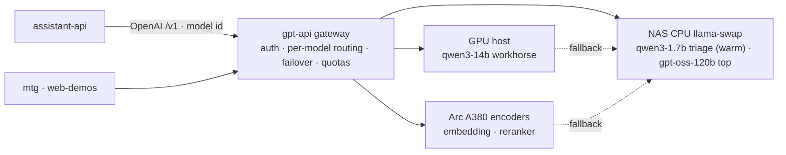

# LLM gateway backbone

**Decision (locked):** gpt-api is the platform's single LLM entry, exposed as an **OpenAI-compatible *gateway*** — the universal contract at the edge, the infra cross-cutting concerns owned inside. Consumers (assistant-api and others) stay plain OpenAI clients that pick a **named tier alias**; the gateway hides the CPU/one-model-at-a-time/swap reality.

**Status:** the contract is set and the gateway backbone is built — `/v1/embeddings` + `/v1/rerank`, per-model routing with failover, an always-warm triage tier, **named tier aliases**, and **per-key quotas + priority**. Only the follow-ups under *What needs implementing* remain.

## Purpose
One place every service reaches the LLM. Keeping the OpenAI `/v1` contract means the backend (llama.cpp/llama-swap today, vLLM or a cloud fallback later) is swappable without touching callers, and tool-calling / structured-output / streaming are standardised. Making it a *gateway* (not just a proxy) means the things a shared, CPU-bound, single-model-at-a-time host **must** manage live in one place instead of being re-implemented by every caller.

## What exists today (grounded)
A real gateway over multiple llama-swap workers:
- **Endpoints:** `/v1/chat/completions` (+SSE), `/v1/completions`, `/v1/models`, **`/v1/embeddings`**, **`/v1/rerank`** (`Endpoints/`, `EmbeddingsEndpoint.cs`).
- **Per-model routing + failover** (`Models/LlamaOptions.cs`: `Backends` + `Routes`, primary→fallback): each request's `model` is dispatched to a named backend, with a fallback when the primary is unreachable. Where a model runs is config, not code.
- **api-key auth** (Bearer / `X-API-Key` / `?api_key`) + **per-key quotas**: each key's requests/min budget is its own rate-limiter bucket (config fallback for unset keys), plus a recorded `Priority` tier.
- **Named tier aliases** (`Models/LlamaOptions.cs`: `Aliases`): a caller-facing tier name resolves to a concrete model id *before* routing, so consumers don't hard-code GGUF ids and a model can be re-pointed in config; advertised on `/v1/models`.
- **Roster across backends:** `qwen3-1.7b` (triage, **always-warm resident**, runs on every inbound) · `qwen3-14b` (workhorse generation/orchestration, GPU-host→CPU fallback, proven OpenAI tool-calls via `--jinja`) · `gpt-oss-120b` (top reasoning, CPU MoE, load-on-demand) · `qwen3-embedding-0.6b` · `qwen3-reranker-0.6b` — encoders on the **Arc A380** (Vulkan, ~2 GB) with CPU fallback.
- **Swap discipline:** llama-swap `groups` keep triage resident while the heavy models swap among themselves without evicting it (`deploy/llama-swap.yaml`).

## The gateway role — owns vs delegates

**Gateway owns** (infra cross-cutting): per-model routing + failover · kept-warm/swap policy (`groups`) · embeddings + rerank · named tier aliases · per-key quotas + priority · observability.
**Stays in assistant-api** (product logic): prompts, tool-calling loops, conversation/memory, *which tier a task needs* (the caller picks), and **per-user isolation** — the model is stateless per request, so never mixing two users in one prompt is the assistant's job. The gateway only sees keys, not users.

## What needs implementing
The backbone is complete — `/v1/embeddings` ✅, `/v1/rerank` ✅, per-model routing + failover ✅, kept-warm triage via `groups` ✅, named tier aliases ✅, per-key quotas + priority ✅. Follow-ups:

- **Cross-key contention scheduling** — making the latency-sensitive triage tier win under load needs llama-swap-level scheduling. The gateway records each key's `Priority`, but the ASP.NET rate limiter only arbitrates within a single key's own partition, not across keys.
- **Daily token-budget enforcement** — `Auth:ApiKeys[].DailyTokenBudget` is a config surface today; enforcing it needs a stateful per-key/day token counter (read from response usage), deferred to keep the per-key requests/min limiter focused.

## Contract pin
Consumers are OpenAI clients hitting `gpt-api.lupira.com/v1`, choosing `model` explicitly — either raw ids (`qwen3-1.7b` triage · `qwen3-14b` workhorse · `gpt-oss-120b` reasoning · `qwen3-embedding-0.6b` · `qwen3-reranker-0.6b`) or a tier alias (`assistant-fast` / `assistant-reasoning` / `assistant-balanced` / `embed` / `rerank`). **No gateway auto-routing** — the caller knows the task's needs.

## Open decisions
1. ✅ Alias names — `assistant-fast`→`qwen3-1.7b`, `assistant-reasoning`→`gpt-oss-120b`, `assistant-balanced`→`qwen3-14b`, `embed`→`qwen3-embedding-0.6b`, `rerank`→`qwen3-reranker-0.6b` (config-tunable via `Llama:Aliases`).
2. ✅ Keep-warm mechanism — llama-swap `groups` (triage `resident`/persistent; heavies swap without evicting it).
3. ✅ Embed dimension — `qwen3-embedding-0.6b` (Qwen3-Embedding-0.6B) emits **1024-dim** vectors natively, and is MRL-capable (a caller can request a smaller dim via the `dimensions` param, 32–1024). assistant-api should size its pgvector column to **1024** unless it explicitly requests a smaller `dimensions`. (Re-verify against the loaded GGUF if a non-standard export is used.)
