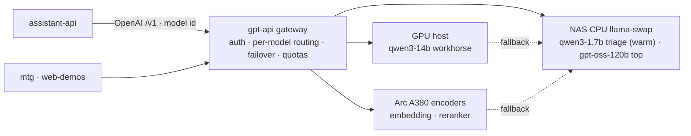

# LLM gateway backbone

**Decision (locked):** gpt-api is the platform's single LLM entry, exposed as an **OpenAI-compatible *gateway*** — the universal contract at the edge, the infra cross-cutting concerns owned inside. Consumers (assistant-api and others) stay plain OpenAI clients that pick a **named tier alias**; the gateway hides the CPU/one-model-at-a-time/swap reality.

**Status:** the contract is set and much of the gateway is now built — `/v1/embeddings` + `/v1/rerank`, per-model routing with failover, and an always-warm triage tier all landed (commits `7f4ba42`, `e0b3c9c`). Remaining: named aliases + per-key quotas.

## Purpose
One place every service reaches the LLM. Keeping the OpenAI `/v1` contract means the backend (llama.cpp/llama-swap today, vLLM or a cloud fallback later) is swappable without touching callers, and tool-calling / structured-output / streaming are standardised. Making it a *gateway* (not just a proxy) means the things a shared, CPU-bound, single-model-at-a-time host **must** manage live in one place instead of being re-implemented by every caller.

## What exists today (grounded)
A real gateway over multiple llama-swap workers:
- **Endpoints:** `/v1/chat/completions` (+SSE), `/v1/completions`, `/v1/models`, **`/v1/embeddings`**, **`/v1/rerank`** (`Endpoints/`, `EmbeddingsEndpoint.cs`).
- **Per-model routing + failover** (`Models/LlamaOptions.cs`: `Backends` + `Routes`, primary→fallback): each request's `model` is dispatched to a named backend, with a fallback when the primary is unreachable. Where a model runs is config, not code.
- **api-key auth** (Bearer / `X-API-Key` / `?api_key`) + rate-limiting.
- **Roster across backends:** `qwen3-1.7b` (triage, **always-warm resident**, runs on every inbound) · `qwen3-14b` (workhorse generation/orchestration, GPU-host→CPU fallback, proven OpenAI tool-calls via `--jinja`) · `gpt-oss-120b` (top reasoning, CPU MoE, load-on-demand) · `qwen3-embedding-0.6b` · `qwen3-reranker-0.6b` — encoders on the **Arc A380** (Vulkan, ~2 GB) with CPU fallback.
- **Swap discipline:** llama-swap `groups` keep triage resident while the heavy models swap among themselves without evicting it (`deploy/llama-swap.yaml`).

## The gateway role — owns vs delegates

**Gateway owns** (infra cross-cutting): per-model routing + failover · kept-warm/swap policy (`groups`) · embeddings + rerank · named tier aliases · per-key quotas + priority · observability.
**Stays in assistant-api** (product logic): prompts, tool-calling loops, conversation/memory, *which tier a task needs* (the caller picks), and **per-user isolation** — the model is stateless per request, so never mixing two users in one prompt is the assistant's job. The gateway only sees keys, not users.

## What needs implementing
Most of the original P1 is **done** — `/v1/embeddings` ✅, `/v1/rerank` ✅ (bonus), per-model routing + failover ✅, kept-warm triage via `groups` ✅. Remaining:

- **Named tier aliases** — publish `assistant-fast` / `assistant-reasoning` / `embed` / `rerank` resolving to the concrete models (`qwen3-1.7b` / `gpt-oss-120b` / `qwen3-embedding-0.6b` / `qwen3-reranker-0.6b`), so assistant-api doesn't hard-code GGUF ids and a model can be re-pointed without touching consumers. The `Routes` layer already exists to hang this on.
- **Per-key / per-consumer quotas + priority** *(P2)* — beyond the flat rate-limit, so the assistant, mtg, and demos don't starve each other and the latency-sensitive triage tier wins contention.

## Contract pin
Consumers are OpenAI clients hitting `gpt-api.lupira.com/v1`, choosing `model` explicitly — today raw ids (`qwen3-1.7b` triage · `qwen3-14b` workhorse · `gpt-oss-120b` reasoning · `qwen3-embedding-0.6b` · `qwen3-reranker-0.6b`), and the alias layer (`assistant-fast` / `assistant-reasoning` / …) once added. **No gateway auto-routing** — the caller knows the task's needs.

## Open decisions
1. Alias names (`assistant-fast` / `assistant-reasoning` / `embed` / `rerank` vs other labels) — the only real open item.
2. ✅ Keep-warm mechanism — llama-swap `groups` (triage `resident`/persistent; heavies swap without evicting it).
3. ✅ Embed model — `qwen3-embedding-0.6b`; still confirm its embedding **dimension** to size the pgvector column on the assistant side.
